# LedgerFlow — Database Architecture

Production-ready SQLite database for the LedgerFlow accounting desktop system,
designed in **Third Normal Form (3NF)** with Prisma ORM.

## Stack

| Layer      | Technology                    |
| ---------- | ----------------------------- |
| Database   | SQLite 3                     |
| ORM        | Prisma 6 (`prisma-client-js`) |
| IDs        | UUID (application-generated)  |
| Migrations | `prisma migrate dev/deploy`   |

## Design Principles

1. **3NF** — no transitive dependencies; lookup tables (`Category`, `Unit`,
   `Permission`, `CostCenter`) normalize repeating attributes out of entity tables.
2. **UUID PKs** on every table, generated via `@default(uuid())`.
3. **Soft delete** — every entity carries `deletedAt DateTime?`; repositories
   filter `deletedAt: null` globally. Data is never physically removed.
4. **Timestamps** — `createdAt` + `updatedAt` on every entity.
5. **Multi-company (tenant)** — every business table carries `companyId`
   referencing `Company`; `@@unique` scopes are company-local.
6. **Multi-user RBAC** — `User → Role ⇄ Permission` via `RolePermission` join.
7. **Audit trail** — `AuditLog` is append-only, never mutated/deleted.
8. **Money** — stored as `REAL` (Float); 2-decimal rounding is enforced in the
   application layer. `creditLimit`, `balance`, prices, journal debits/credits
   all follow this convention.
9. **Inventory ledger** — `StockMovement` is the append-only source of truth;
   `StockItem` is a denormalized projection (on-hand qty per product+warehouse)
   optimized for reads.
10. **Invoices** — one `Invoice` table discriminated by `type`
    (`sales` | `purchase`); lines and payments are normalized child tables.

## ERD

```mermaid
erDiagram
    Company ||--o{ User : "has users"
    Company ||--o{ Role : "has roles"
    Company ||--o{ Party : "has parties"
    Company ||--o{ Category : "has categories"
    Company ||--o{ Product : "has products"
    Company ||--o{ Warehouse : "has warehouses"
    Company ||--o{ StockItem : "owns"
    Company ||--o{ StockMovement : "owns"
    Company ||--o{ Invoice : "owns"
    Company ||--o{ TreasuryAccount : "owns"
    Company ||--o{ TreasuryTransaction : "owns"
    Company ||--o{ Account : "chart of accounts"
    Company ||--o{ CostCenter : "has cost centers"
    Company ||--o{ JournalEntry : "owns"
    Company ||--o{ Asset : "owns"
    Company ||--o{ Report : "owns"
    Company ||--o{ Setting : "owns"
    Company ||--o{ Backup : "owns"
    Company ||--o{ AuditLog : "owns"

    Role ||--o{ User : "assigns"
    Role ||--o{ RolePermission : "grants"
    Permission ||--o{ RolePermission : "granted via"
    User ||--o{ AuthSession : "opens"
    User ||--o{ AuditLog : "performs"

    Party ||--o{ Invoice : "sales customer"
    Party ||--o{ Invoice : "purchase supplier"
    Party ||--o{ TreasuryTransaction : "linked to"
    Party ||--o{ StockMovement : "linked to"

    Category ||--o{ Product : "classifies"
    Unit ||--o{ Product : "measures"

    Product ||--o{ StockItem : "stocked as"
    Product ||--o{ StockMovement : "moved as"
    Product ||--o{ InvoiceLine : "sold/bought as"
    Warehouse ||--o{ StockItem : "holds"
    Warehouse ||--o{ StockMovement : "records"
    Warehouse ||--o{ Invoice : "fulfills from"

    Invoice ||--o{ InvoiceLine : "contains"
    Invoice ||--o{ InvoicePayment : "receives"
    TreasuryAccount ||--o{ InvoicePayment : "credited/debited"
    TreasuryAccount ||--o{ TreasuryTransaction : "records"
    Invoice ||--o{ TreasuryTransaction : "references"

    Account ||--o{ JournalDetail : "posted to"
    JournalEntry ||--o{ JournalDetail : "composed of"
    CostCenter ||--o{ JournalDetail : "allocates"
    Account ||--o{ Account : "parent of (self)"
    CostCenter ||--o{ CostCenter : "parent of (self)"

    Account ||--o{ Asset : "fixed asset acct"
    Account ||--o{ Asset : "accum dep acct"
    Account ||--o{ Asset : "dep expense acct"
```

## Module → Table Mapping

| Module                 | Tables                                                                   |
| ---------------------- | ------------------------------------------------------------------------ |
| Authentication         | `User`, `Role`, `AuthSession`                                            |
| Users                  | `User`                                                                   |
| Roles & Permissions    | `Role`, `Permission`, `RolePermission`                                   |
| Customers / Suppliers  | `Party` (`type = customer` / `type = supplier`)                          |
| Products / Categories  | `Product`, `Category`, `Unit`                                            |
| Warehouses             | `Warehouse`                                                              |
| Inventory              | `StockItem`, `StockMovement`                                             |
| Sales / Sales Items    | `Invoice` (`type = sales`), `InvoiceLine`, `InvoicePayment`              |
| Purchases / Purch Items| `Invoice` (`type = purchase`), `InvoiceLine`, `InvoicePayment`           |
| Treasury (Cash/Bank/…) | `TreasuryAccount`, `TreasuryTransaction`                                 |
| Expenses / Income      | `TreasuryTransaction` (`type = expense` / `type = income`) + `Category`  |
| Journal Entries        | `JournalEntry`, `JournalDetail`                                          |
| Chart of Accounts      | `Account` (self-referencing hierarchy)                                   |
| Cost Centers           | `CostCenter` (self-referencing hierarchy)                                |
| Assets                 | `Asset`                                                                  |
| Reports                | `Report` (saved report definitions)                                      |
| Settings               | `Setting` (key/value, company-scoped)                                    |
| Backup History         | `Backup`                                                                 |
| Audit Logs             | `AuditLog`                                                               |

## Referential Integrity (FK rules)

| Parent        | Child                  | Rule              |
| ------------- | ---------------------- | ----------------- |
| Company       | all tenant tables      | `CASCADE` (delete company ⇒ delete its data) |
| Role          | User                   | `RESTRICT` (can't delete assigned role) |
| Role          | RolePermission         | `CASCADE` |
| Permission    | RolePermission         | `CASCADE` |
| User          | AuthSession, AuditLog  | `CASCADE` / `RESTRICT` |
| Party         | Invoice (customer/supplier) | `SET NULL` |
| Party         | TreasuryTransaction    | `SET NULL` |
| Category      | Product                | `SET NULL` |
| Unit          | Product                | `RESTRICT` |
| Product       | InvoiceLine            | `SET NULL` |
| Product/Warehouse | StockItem          | `CASCADE` |
| Product/Warehouse | StockMovement      | `RESTRICT` (preserve ledger) |
| Invoice       | InvoiceLine, InvoicePayment | `CASCADE` |
| TreasuryAccount | InvoicePayment, TreasuryTransaction | `RESTRICT` |
| JournalEntry  | JournalDetail          | `CASCADE` |
| Account       | JournalDetail          | `RESTRICT` |

## Query Optimization (indexes)

- **FK columns** indexed everywhere (e.g. `productId`, `warehouseId`,
  `accountId`, `invoiceId`, `roleId`).
- **Compound indexes for hot paths**:
  - `Invoice(companyId, type, status)` — dashboard/AR/AP lists
  - `Invoice(companyId, invoiceDate)` — date-range reports
  - `TreasuryTransaction(accountId, date)` — account statements
  - `StockMovement(productId, warehouseId)` — item ledger
  - `AuditLog(companyId, createdAt)` — audit browsing
  - `Party(companyId, type, status)` — customer/supplier lists
- **Unique constraints prevent duplicates**:
  - `User(companyId, email)`, `Role(companyId, name)`, `Party(companyId, code)`
  - `Product(companyId, sku)`, `Invoice(companyId, number)`, `Account(companyId, code)`
  - `StockItem(productId, warehouseId)`, `RolePermission(roleId, permissionId)`
  - `Setting(companyId, key)`, `Report(companyId, name)`, `Unit(code)`

## Soft Delete Convention

- All soft-deletable tables have `deletedAt DateTime?`.
- The Prisma repository layer applies a global filter `deletedAt: null`.
- Unique constraints remain enforced even for soft-deleted rows; on delete of a
  row that shares a uniqueness key, the application appends a suffix to the
  code/number/sku before soft-deleting (freeing the unique key).

## Audit Trail

`AuditLog` stores `actorId`, `actorEmail`, `action`, `resource`, `resourceId`,
`ip` and a JSON `details` payload. Entries are **append-only** — no update or
delete operations are ever exposed for audit rows.

## Migration Strategy

| Environment | Command                                  |
| ----------- | ---------------------------------------- |
| Development | `npm run prisma:migrate` (`prisma migrate dev`) — auto-generates SQL, applies, regenerates client |
| Production  | `npm run prisma:migrate:prod` (`prisma migrate deploy`) — applies committed migrations only |
| Reset       | `npm run prisma:reset` — drops schema, reapplies migrations + seed |
| Seed        | `npm run prisma:seed` (`prisma db seed`) |
| Studio      | `npm run prisma:studio` |

### Workflow

1. Edit `prisma/schema.prisma`.
2. Run `npm run prisma:migrate` → creates a timestamped migration folder in
   `prisma/migrations/` and applies it to the dev DB.
3. Commit the generated `migration.sql` + schema changes together.
4. In production, run `npm run prisma:migrate:prod`.

### Migration Timeline (future)

| Phase | Change                                            | Migration |
| ----- | ------------------------------------------------- | --------- |
| 1     | Initial schema (27 tables)                        | `20260802105920_init` ✅ applied |
| 2     | Swap in-memory repositories → Prisma repositories | none (code only) |
| 3     | Add per-product pricing tiers / price lists       | `add_pricing` |
| 4     | Add tax groups & tax regimes                      | `add_tax` |
| 5     | Multi-warehouse batch transfers                   | `add_batch_transfer` |

## Seed Data

`prisma/seed.ts` (idempotent via upserts):

- 1 default company (`company-default`)
- 54 permissions incl. super-admin wildcard `*`
- 4 roles (Super Admin, Accountant, Sales Manager, Viewer) with 106 role-permission links
- 1 admin user: `admin@ledgerflow.local` / `Admin@123!`
- 5 customers, 3 suppliers
- 5 units, 4 categories, 8 products, 8 stock items + 8 initial stock movements
- 2 warehouses, 3 treasury accounts, 12 chart-of-account entries, 4 cost centers
- 17 settings (company profile + preferences)

Run with `npm run prisma:seed`.

## Files

| File                                   | Purpose                          |
| -------------------------------------- | -------------------------------- |
| `prisma/schema.prisma`                 | Prisma schema (source of truth)  |
| `prisma/migrations/*/migration.sql`    | Committed migration SQL          |
| `prisma/seed.ts`                       | Seed data                        |
| `prisma.config.ts`                     | Prisma CLI config (env, seed)    |
| `backend/prisma/dev.db`                | Local SQLite dev database        |
